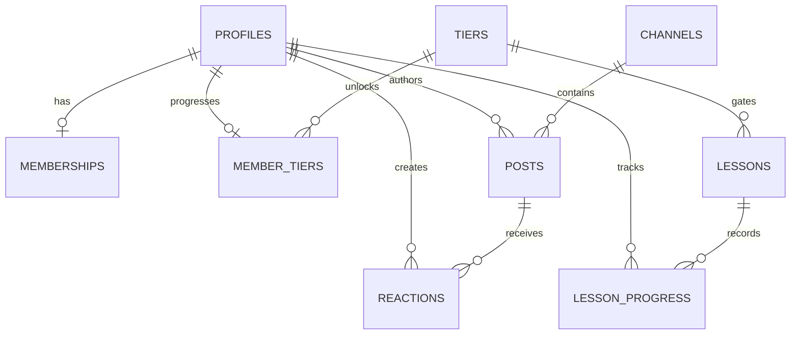

# Database Schema
## Stoicverse Single-Community Model

**Last Updated:** July 11, 2026

## Scope

The database supports one global Stoicverse community. There is no `communities` table, `community_roles` table, community slug, tenant identifier, or community owner relationship. Every membership, channel, post, event, lesson, tier, and payment is global to Stoicverse.

## Identity And Roles

`auth.users` is managed by Supabase Auth. `public.profiles` extends each account with `full_name`, `avatar_url`, `is_suspended`, and a global `platform_role`:

- `member`
- `moderator`
- `influencer`
- `super_admin`

The partial unique index `profiles_one_influencer_idx` ensures that there can be at most one influencer account. A super admin assigns this role when the Stoicverse influencer account is created; the role does not create or own a separate community.

## Singleton Configuration

`platform_settings` has exactly one row, enforced by a `singleton` boolean primary key constrained to `true`. It holds `community_name` (default `Stoicverse`), membership pricing, Stripe price identifiers, and the optional `influencer_id` reference.

## Core Tables

| Table | Purpose |
| --- | --- |
| `profiles` | Account profile, suspension state, and global platform role. |
| `platform_settings` | The singleton Stoicverse configuration record. |
| `memberships` | One paid membership lifecycle per user, with global status and billing dates. |
| `payments` | Stripe payment and refund records. |
| `channels` | Stoicverse-wide discussion channels. |
| `posts` | Messages within channels. |
| `reactions` | A member's reaction to a post. |
| `events` | Stoicverse events and gated attendance details. |
| `tiers` | Global curriculum tiers. |
| `lessons` | Global, tier-gated lessons. |
| `member_tiers` | A member's active tier and unlock state. |
| `lesson_progress` | Per-member lesson completion and watch progress. |
| `review_applications` | Master-tier review requests. |
| `team_applications` | Moderator or team applications. |
| `mentorships` | Optional mentorship purchases and fulfillment status. |
| `notifications` | Member notifications. |
| `stripe_webhook_events` | Idempotency ledger for Stripe webhooks. |

## Relationships

## Access And RLS

- Every application table has Row Level Security enabled.
- A user can read and update only their own profile fields; role and suspension changes are staff-controlled.
- Active, non-suspended membership is required to read protected community, course, event, progression, and payment data.
- `super_admin` has platform-wide operational access.
- The single `influencer` and moderators have global Stoicverse content and moderation permissions; no policy is scoped by community id.
- Payments and Stripe webhook records are written by trusted server-side code only.

## Lifecycle Automation

- Creating or activating a membership creates the member's global `member_tiers` record if needed.
- Updated-at triggers maintain timestamp fields.
- Stripe webhook processing changes membership state only after server-side validation and records event ids in `stripe_webhook_events` to prevent duplicate processing.

## Migrations

The current model is introduced by `supabase/migrations/20260711000005_single_stoicverse_schema.sql`. It replaces the earlier multitenant schema. Any future migration must preserve the single-community invariant and must not add `community_id` to application tables unless the product scope changes explicitly.
